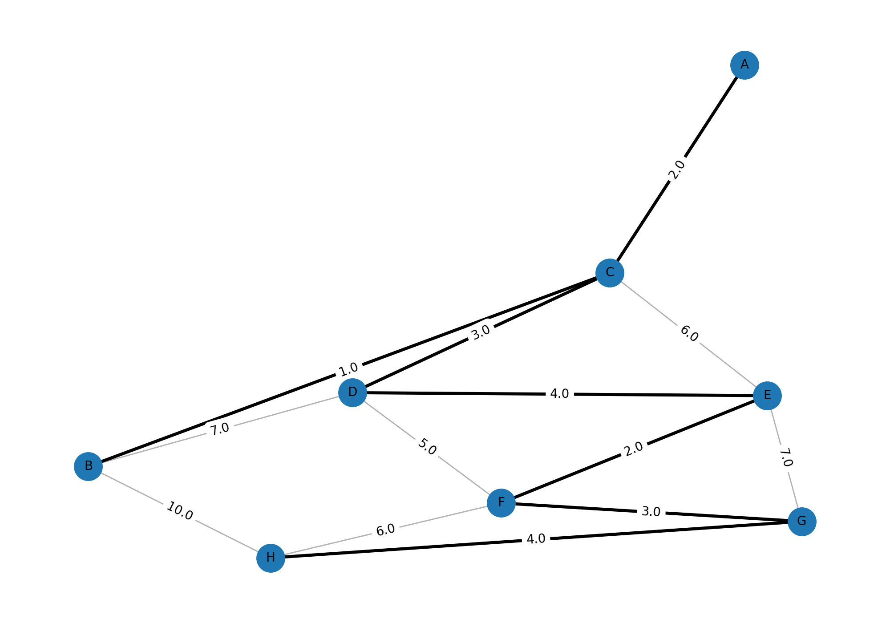
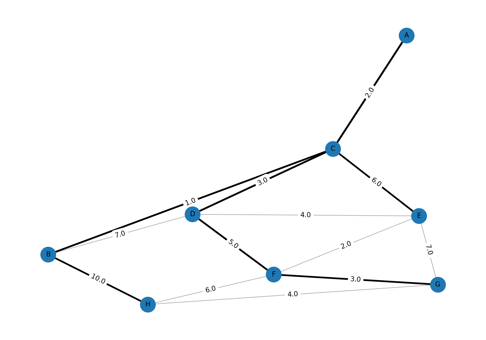
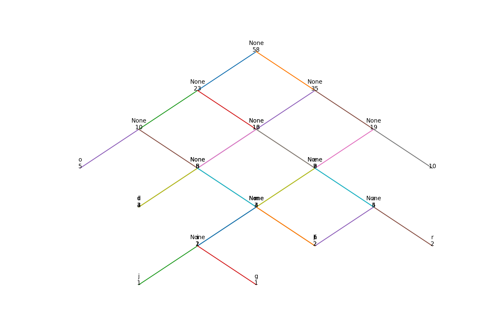
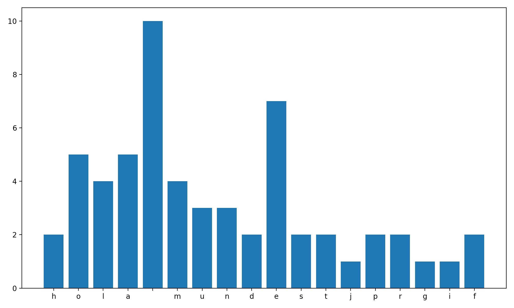

## Universidad Da Vinci de Guatemala
Facultad de Ingeniería Industria y Tecnología
Análisis de Algoritmos
Proyecto Final – Implementación y Visualización de Algoritmos Avanzados

Estudiante: Elder Donaldo Salazar Garrido
Carnet: 202305764
Fecha: 25 de noviembre de 2025

## 1. Objetivo General

Desarrollar un programa en Python que implemente, analice y visualice los algoritmos de Prim, Kruskal, Dijkstra y Huffman, utilizando archivos externos como entrada y generando imágenes PNG como parte de los resultados. El proyecto también incluye la aplicación del flujo de trabajo Gitflow y la documentación completa del proceso.

## 2. Objetivos Específicos

Implementar de manera modular los algoritmos de Prim, Kruskal, Dijkstra y Huffman.

Leer datos desde archivos externos, utilizando archivos CSV para los grafos y TXT para el texto.

Generar imágenes PNG que muestren el funcionamiento de cada algoritmo.

Elaborar un README detallado con teoría, resultados e imágenes.

Aplicar Gitflow correctamente (ramas, merges, PRs, tags, release y hotfix).

Analizar la complejidad teórica de cada algoritmo.

## 3. Teoría de los Algoritmos
## 3.1 Prim

El algoritmo de Prim construye un Árbol de Expansión Mínima (MST). Inicia desde un nodo y va agregando las aristas de menor peso que conectan nuevos nodos sin formar ciclos.

## 3.2 Kruskal

Kruskal ordena todas las aristas del grafo por peso y las va agregando una por una siempre que no formen ciclos. Utiliza estructuras como conjuntos o Union-Find.

## 3.3 Dijkstra

Dijkstra calcula las rutas más cortas desde un nodo origen hacia todos los demás. Identifica los caminos con menor costo y registra tanto la distancia como la ruta completa.

## 3.4 Huffman

Huffman genera códigos de compresión óptimos basados en la frecuencia de los caracteres. Crea un árbol donde los caracteres más frecuentes tienen códigos más cortos.

## 4. Complejidad Teórica
He agregado una tabla para conocer la complejidad de cada algoritmo según lo desarrollado

| Algoritmo | Complejidad      |
| --------- | ---------------- |
| Prim      | O(E log V)       |
| Kruskal   | O(E log E)       |
| Dijkstra  | O((V + E) log V) |
| Huffman   | O(n log n)       |

## 5. Formato de Entrada
5.1 Archivo CSV para Prim, Kruskal y Dijkstra

Estos como podemos ver, deben tener tres columnas: origen, destino, peso.
En esta parte lo he colocado de la siguiente manera, tal cual está.

Ejemplo:

origen,destino,peso
A,B,4
A,C,2
B,C,1
B,D,7
C,D,3
C,E,6
D,E,4
D,F,5
E,F,2
E,G,7
F,G,3
G,H,4
F,H,6
B,H,10

## 5.2 Archivo TXT para Huffman

Aqui he implementado un claro ejemplo como el famoso "hola mundo".
Ejemplo:

"hola mundo este es un ejemplo para el algoritmo de huffman"

## 6. Ejecución del Programa

Para ejecutar el menú principal utilizaremos el comando: ""python main.py"".
El cual nos mostrará en pantalla el menú de la siguiente forma:

1. Ejecutar Prim
2. Ejecutar Kruskal
3. Ejecutar Dijkstra
4. Ejecutar Huffman
5. Salir

## 7. Resultados Obtenidos

A continuación se muestran las imágenes generadas por el programa.

7.1 Prim – Árbol de Expansión Mínima

7.2 Kruskal – Árbol de Expansión Mínima

7.3 Dijkstra – Caminos más Cortos

7.4 Huffman – Árbol de Codificación

7.5 Huffman – Frecuencias de Caracteres

## 8. Flujo Gitflow Aplicado

Para este proyecto se aplicó Gitflow como flujo de trabajo principal. Se utilizaron las siguientes ramas:

main

develop

feature/prim

feature/kruskal

feature/dijkstra

feature/huffman

release/v1.0.0

hotfix/cambiar_nombre

También se realizaron:

Pull Requests de las ramas feature hacia develop

Pull Request de develop hacia main

Tag obligatorio: v1.0.0

Tag del hotfix

Las evidencias se encuentran en: docs/evidencias/

## 9. Conclusiones

Este proyecto me permitió trabajar de forma práctica con varios algoritmos importantes, utilizando datos externos y generando resultados visuales en formato PNG. Fue interesante ver cómo Python puede generar imágenes a partir de los algoritmos y cómo se pueden representar gráficamente estructuras como árboles o rutas más cortas.
También reforcé el uso de Gitflow, ya que pude trabajar con ramas, merges, releases y hotfixes de una manera más ordenada.
Además, implementar cada algoritmo por separado y luego integrarlo en un menú me ayudó a comprender mejor su funcionamiento y cómo organizar un proyecto modular en Python.

## 10. Colaborador del Repositorio

Se agregó al repositorio al usuario solicitado:

cesarsazo